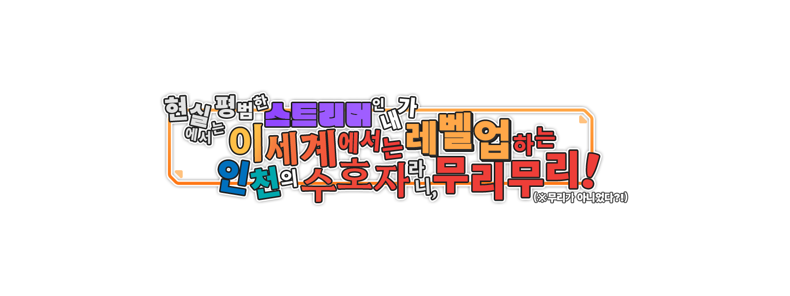

# 📝 README

 

## 🪪 Introduction
> 게임 개발자를 꿈꾸는 대학생입니다!

 

## 🛠️ Tech Stack

  
  
  
   
  
  

 

## 💻 Project
> #### 현실에서는 평범한 스트리머인 내가 이세계에서는 레벨업하는 인천의 수호자라니, 무리무리! (※무리가 아니었다?!)
> 
> - Unreal Engine 5.2
> - 2023.01.23 ~ 2023.12.26

> #### 너와 나의 차가리 해피니스
> 추가 예정
> - Unity 2022.3.4f1
> - 2023.10.19 ~

> #### 오직 IQ 510 이상의 사람만이 이 전메를 찾을 수 있습니다
> 추가 예정
> - Unity 2022.3.17f1
> - 2024.03.20 ~ 2024.05.10

 

  

