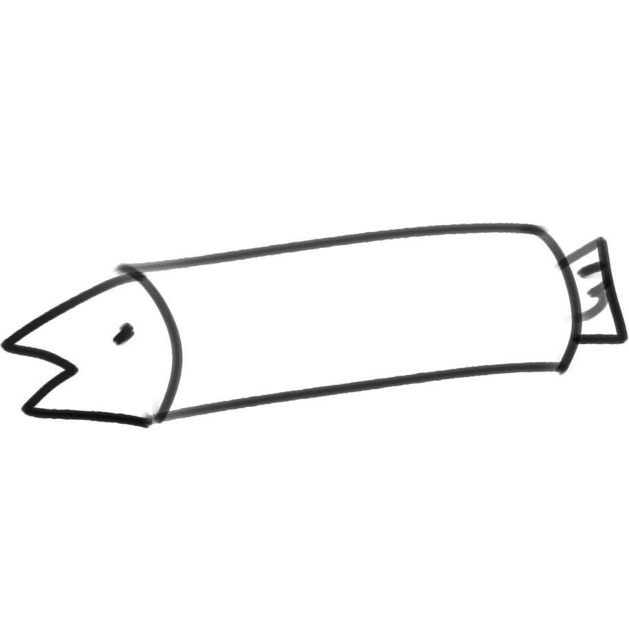
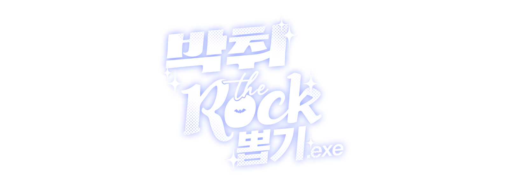
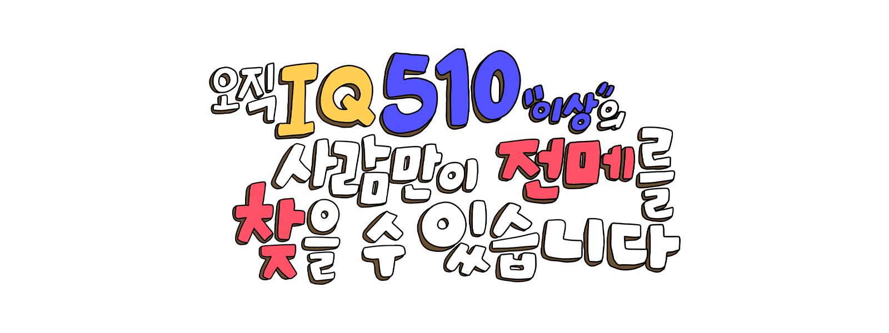
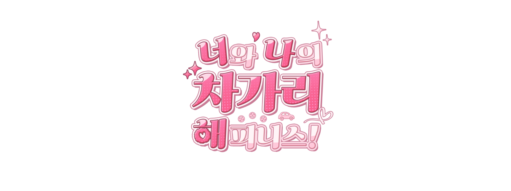
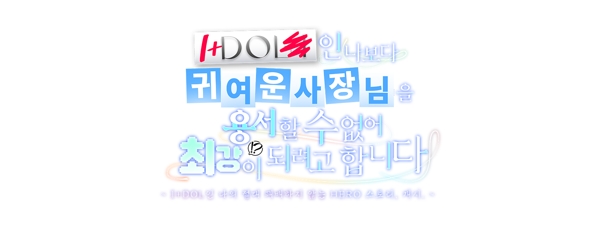
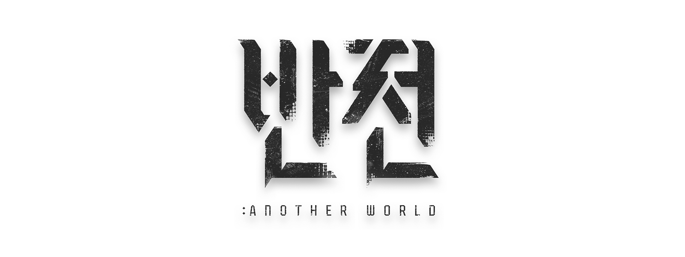

# 📝 README

 

## 🪪 Introduction

  

> 게임 개발자를 꿈꾸는 대학생입니다!   
> 단국대학교 소프트웨어학과 1학년을 마치고, 2024년 6월에 군에 입대하였습니다!

 

## 🛠️ Tech Stack

  
  
  
   
  
  

 

## 💻 Project
> ### 🎲 박취더락 뽑기
> 
> **📺 이미지를 클릭하면 영상이 재생됩니다!**   
> - 2023.09 - 2023.12
> - 캐주얼, 유틸리티
> - Unity 2022.3.4f1
>    
> 버추얼 스트리머 **릴파**의 컨텐츠인 박취더락을 위해 게임 참가 인원을 선정하는 프로그램을 개발하였습니다.   
> 프로그래밍 파트 전반을 혼자 구현하였습니다.   
> 간단한 오브젝트 풀링을 활용한 최적화, UI 이미지의 물리 이동 구현을 포인트로 개발하였습니다.   
   
> ### 🛡️ 현실에서는 평범한 스트리머인 내가 이세계에서는 레벨업하는 인천의 수호자라니, 무리무리! (※무리가 아니었다?!)
> 
> **📺 이미지를 클릭하면 영상이 재생됩니다!**   
> - 2023.01 - 2023.12
> - 디펜스, FPS
> - Unreal Engine 5.2
>    
> 유튜버 **우왁굳**의 2023년 연말 공모전 출품작입니다.   
> 다양한 종류의 몬스터를 물리치며 경험치를 쌓아 여러 능력을 획득해 싸우는 게임입니다.   
> 프로젝트 팀장을 맡았으며, 프로그래밍 파트 전반을 혼자 구현하였습니다.   
> 처음 다뤄보는 언리얼 엔진의 다양한 기능을 경험해볼 수 있었습니다.   
> 베타 테스트를 통해 다양한 의견을 수렴하며, 완성도 높은 게임을 만들기 위해 노력하였습니다.   
   
> ### 🧩 오직 IQ 510 이상의 사람만이 이 전메를 찾을 수 있습니다
> 
> **📺 이미지를 클릭하면 영상이 재생됩니다!**   
> - 2024.03 - 2024.05
> - 캐주얼, 숨은그림찾기
> - Unity 2022.3.17f1
>    
> 버추얼 스트리머 **릴파**의 2024년 전투메이드의 날 출품작입니다.   
> 다양한 캐릭터가 등장하는 숨은그림찾기 게임입니다.   
> 프로그래밍 파트 전반을 혼자 구현하였습니다.   
> 큰 사이즈의 이미지 처리를 포인트로 개발하였습니다.   
   
> ### 🚗 너와 나의 차가리 해피니스
> 
> **📺 이미지를 클릭하면 영상이 재생됩니다!**   
> - 2023.10 - 2024.05
> - 비주얼 노벨
> - 개발 참여 (미니게임 개발, 시스템 개발, 시나리오 리팩토링, 시나리오 폴리싱)
> -  Unity 2022.3.4f1
>    
> 유튜버 **우왁굳**의 팬게임으로, 자동차와 연애하는 컨셉의 비주얼 노벨 게임입니다.   
> 프로그래밍 파트 전반을 구현하였습니다.   
> 쉐이더 코드를 짜보며, 이미지, 화면에 들어가는 효과를 구현하였습니다.   
> 기존의 레거시 시스템을 스스로 분석하고, 버그를 수정하며, 최적화하는 것을 포인트로 개발하였습니다.   
   
> ### 🧗‍♂️ I+DOL인 나보다 귀여운 사장님을 용서할 수 없어 최강이 되려고 합니다
> 
> **📺 이미지를 클릭하면 영상이 재생됩니다!**   
> - 2024.02 - 2024.07
> - 플랫포머
> - 개발 참여 (물리 관련 개발, 맵 에디터 개발)
> - Unity 2022.3.17f1
>    
> 버추얼 스트리머 **고세구**의 2024 고공전 출품작입니다.   
> 고세구를 등에 태우고 다양한 오브젝트를 등반하는 플랫포머 게임입니다.
> 맵 에디터, 물리 파트를 개발하였습니다.   
> 유니티의 커스텀 에디터 시스템을 활용하여 레벨 디자이너용 맵 에디터를 구현하였습니다.   
> 2024년 6월 군입대로 이후 개발은 다른 개발자에게 인계하였습니다.   
   
> ### 🔄 반전 : 또 다른 세계
> 
> **📺 이미지를 클릭하면 영상이 재생됩니다!**   
> - 2024.01 - (개발 중)
> - 2D 슈팅
> - Unity 2022.3.17f1
>    
> 시나리오 시스템 및 비주얼 노벨 파트를 개발하고 있습니다.   
   
> ### 🔄 융터르, 플리즈!
> - 2024.02 - (개발 중)
> - 비주얼 노벨
> - Unity 6000.0.23f1
>    
> 프로젝트 팀장을 맡았으며, 프로그래밍 파트 전반을 개발하고 있습니다.
   
 

  

